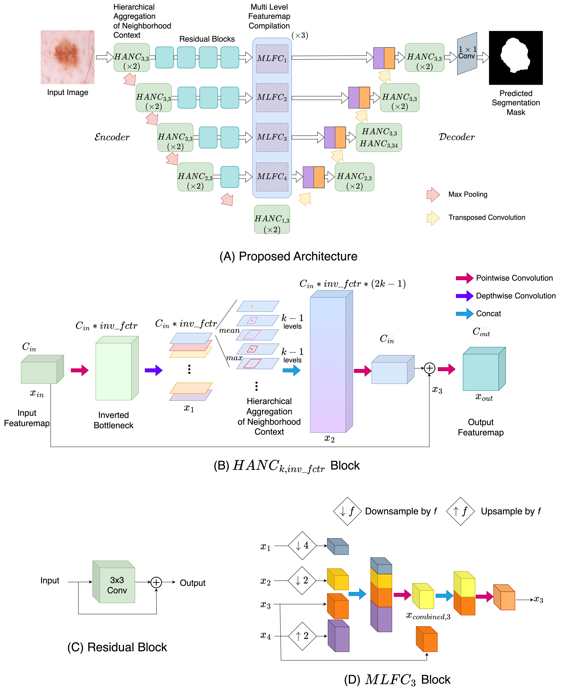

# ACC-UNet
### A Completely Convolutional UNet model for the 2020s

This repository is the official implementation of
ACC-UNet : A Completely Convolutional UNet model for the 2020s using PyTorch.

  

## Introduction

This decade is marked by the introduction of Vision Transformer, a radical paradigm shift in broad computer vision. The similar trend is followed in medical imaging, UNet, one of the most influential architectures, has been redesigned with transformers. Recently, the efficacy of convolutional models in vision is being reinvestigated by seminal works such as ConvNext, which elevates a ResNet to Swin Transformer level. Deriving inspiration from this, we aim to improve a purely convolutional UNet model so that it can be on par with the transformer-based models, e.g, Swin-Unet or UCTransNet. We examined several advantages of the transformer-based UNet models, primarily long-range dependencies and cross-level skip connections. We attempted to emulate them through convolution operations and thus propose, ACC-UNet, a completely convolutional UNet model that brings the best of both worlds, the inherent inductive biases of convnets with the design decisions of transformers. ACC-UNet was evaluated on 5 different medical image segmentation benchmarks and  consistently outperformed convnets, transformers and their hybrids. Notably, ACC-UNet outperforms state-of-the-art models Swin-Unet and UCTransNet by  $2.64 \pm 2.54\%$ and $0.45 \pm 1.61\%$ in terms of dice score, respectively, while using a fraction of their parameters ($59.26\%$ and $24.24\%$).

## Network Architecture

We propose a convolutional UNet, ACC-UNet (Fig. A). We started with a vanilla UNet model and reduced the number of filters in all the layers by half. Then, we replaced the convolutional blocks from the encoder and decoder with our proposed HANC blocks (Fig. B). For all the blocks, we considered $inv\_fctr = 3$, but used $inv\_fctr = 34$ for the last decoder block at level 3 to mimic the $9$ times increase at stage 3 of Swin Transformer. $k=3$, which considers up to $4\times4$ patches (used in Swin Transformer), was selected for all but the bottleneck level. Next, we modified the skip connections by using residual blocks (Fig. C) similar to ResPaths to reduce semantic gap, and stacked 3 MLFC blocks (Fig. D) to fuse the multi-level features. All the convolutional layers were batch-normalized, activated by Leaky-RELU and recalibrated by squeeze and excitation. 

To summarize, in an UNet model, we replaced the classical convolutional blocks with our proposed HANC blocks that perform an approximate version of self-attention and modified the skip connection with MLFC blocks which consider the feature maps from different encoder levels.
The proposed model has $16.77$ M parameters, roughly a $2$M increase than the vanilla UNet model.  

## Model Implementation

A PyTorch implementation of the model can be found in `/ACC_UNet` directory

## Experiments

Please refer to the `/Experiments` directory
